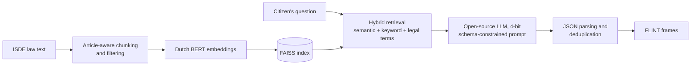
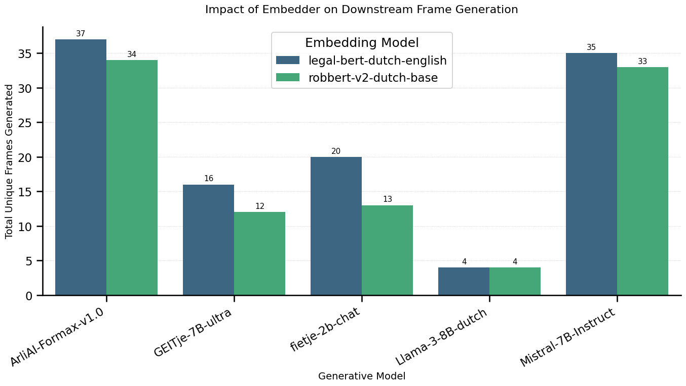
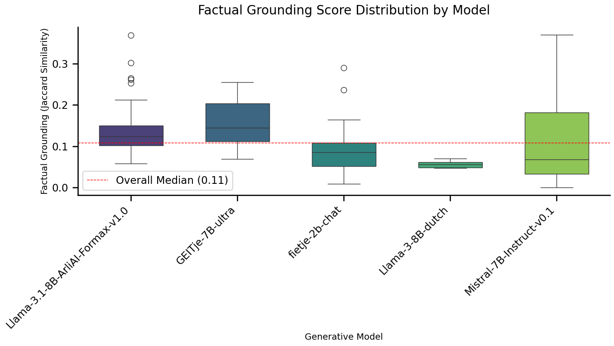

# RAG + eFLINT: turning Dutch subsidy law into structured legal rules

[](https://github.com/Surance/rag-eflint-legal-compliance/actions/workflows/tests.yml)
[](https://colab.research.google.com/github/Surance/rag-eflint-legal-compliance/blob/main/notebooks/01_run_experiments_colab.ipynb)

Code and results of my MSc thesis at the University of Amsterdam (2025):
**_Enhancing Real-Time Legal Compliance: Integrating Retrieval-Augmented Generation Pipelines with FLINT for Dynamic Normative Reasoning_**
Supervisor: Prof. dr. Tom van Engers

> A citizen asks a question about a Dutch home-sustainability subsidy (ISDE). The pipeline finds the relevant articles in the regulation and has an open-source LLM turn them into **FLINT frames**: structured, machine-checkable rules that always point back to the article they came from.

## Why

Applying for a subsidy means working through long, complex legal texts, and assessing applications is slow and often inconsistent. Fully automated decisions are risky (think of the Dutch *toeslagenaffaire*), so this project explores a **human-in-the-loop** approach: automation that prepares and explains the rules, while every output stays traceable to its legal source.

## How it works



1. **Chunking** ([`chunking.py`](src/rag_flint/chunking.py)): the regulation is split per article and sub-point, so every chunk keeps its article number. Metadata and bare definitions are filtered out.
2. **Retrieval** ([`retrieval.py`](src/rag_flint/retrieval.py)): chunks are embedded with a Dutch BERT model (mean pooling) and indexed with FAISS. The top 30 matches are re-ranked on semantic similarity (60%), keyword overlap with the question (30%) and legal-term density (10%).
3. **Generation** ([`generation.py`](src/rag_flint/generation.py)): each retrieved article goes into a zero-shot, schema-constrained prompt. Models run 4-bit quantised, so a 7-8B model fits on a single GPU.
4. **Post-processing:** the output is parsed back into JSON (with a fallback for single frames) and deduplicated on `(action, object)`.

A generated frame looks like this:

```json
{
  "actor": "Eigenaar van een woning",
  "action": "Installeren van een all-electric ready hybride warmtepomp",
  "object": "Een woning",
  "conditions": "De warmtepomp moet tot 1 kW ten behoeve van (tap)waterverwarming blijkens het etiket behoren tot de energie-efficiëntieklasse A+",
  "results": "De subsidie voor de installatie van een all-electric ready hybride warmtepomp bedraagt € 225."
}
```

## Experiment

| | |
|---|---|
| **Embedding models (2)** | `pdelobelle/robbert-v2-dutch-base` (general Dutch), `Gerwin/legal-bert-dutch-english` (legal domain) |
| **Generative models (5)** | Mistral-7B-Instruct, GEITje-7B-ultra, Llama-3-8B-dutch, fietje-2b-chat, Llama-3.1-8B-ArliAI-Formax |
| **Test cases (4)** | Citizen questions about floor insulation, a heat pump, a solar water heater, and an electric cooker after connecting to a heat network |
| **Metrics** | Recall@k against a hand-annotated ground truth, schema adherence, field fill rate, content concreteness, word overlap with the source (grounding), language, run time |

## Key results

40 runs (2 embedders × 5 LLMs × 4 test cases) produced **208 unique frames**, and **every run produced at least one valid frame**, zero-shot.

- **Schema adherence is near perfect:** 205 of 208 frames had exactly the five FLINT fields. The only violations came from the smallest model, fietje-2b.
- **The general Dutch embedder retrieved better than the legal one:** RobBERT had a higher mean top-1 retrieval score (0.717 vs 0.654) and higher Recall@3 and @5. The two embedders often retrieved different articles (overlap 0.27 to 0.67 per test case).
- **Model choice drives output quality:** GEITje-7B-ultra wrote the most detailed and concrete frames (about 52 words, 75 to 81% containing amounts, dates or measurements). ArliAI-Formax was the fastest (about 54 s per question) and produced the most frames.
- **Failure modes are visible:** fewer than half of Mistral's frames were in Dutch despite the Dutch prompt; Llama-3-8B-dutch produced only one frame per question; fietje-2b sometimes left fields empty or copied the question into the frame.

<p align="center">
  
  
</p>

| Embedding model | Recall@3 | Recall@5 | Recall@10 |
|---|---|---|---|
| legal-bert-dutch-english | 0.075 | 0.125 | 0.200 |
| robbert-v2-dutch-base | 0.100 | 0.175 | 0.200 |

All tables are in [`results/summary/`](results/summary) and all figures in [`figures/`](figures).

**Limitations.** Absolute recall is low: the law repeats the same rule in several places, so one good chunk is often enough for a correct frame, but in a legal setting missed context can still mislead. The ground truth was annotated by a non-lawyer, the test set is small (4 questions), and frame quality was measured with proxies rather than expert review.

## Repository structure

```
├── src/rag_flint/            # the pipeline as an installable package
│   ├── config.py             # models, test cases, settings
│   ├── chunking.py           # article-aware chunking and cleaning
│   ├── retrieval.py          # embeddings, FAISS index, hybrid re-ranking
│   ├── generation.py         # prompt, LLM loading, JSON parsing, deduplication
│   ├── experiment.py         # experiment loop + command-line interface
│   └── evaluation/           # metrics and figures
├── scripts/
│   ├── evaluate.py           # recompute all tables and figures
│   └── export_chunks_for_annotation.py
├── notebooks/
│   ├── 01_run_experiments_colab.ipynb   # run everything on Colab
│   └── 02_analysis_and_figures.ipynb    # original analysis with outputs
├── data/                     # ground truth (+ the ISDE law text, see data/README.md)
├── results/                  # summary tables, retrieved chunk IDs, raw outputs
├── figures/                  # all figures
└── tests/                    # unit tests (no GPU needed)
```

## Getting started

**On Google Colab (easiest):** open [`notebooks/01_run_experiments_colab.ipynb`](notebooks/01_run_experiments_colab.ipynb) with the badge above and follow the steps.

**Locally (GPU needed for the LLMs):**

```bash
git clone https://github.com/Surance/rag-eflint-legal-compliance.git
cd rag-eflint-legal-compliance
pip install -e ".[pipeline,evaluation]"

export HF_TOKEN=...                      # Hugging Face token, never commit it
python -m rag_flint.experiment           # writes results/raw/*.json
python scripts/evaluate.py               # writes results/summary/ and figures/
```

Run a subset with, for example, `python -m rag_flint.experiment --generative-models BramVanroy/GEITje-7B-ultra`.

**Tests** (no GPU or model downloads): `pip install -e ".[dev]" && pytest`

## Built with

Python · PyTorch · Hugging Face Transformers · bitsandbytes · FAISS · pandas · matplotlib · seaborn
